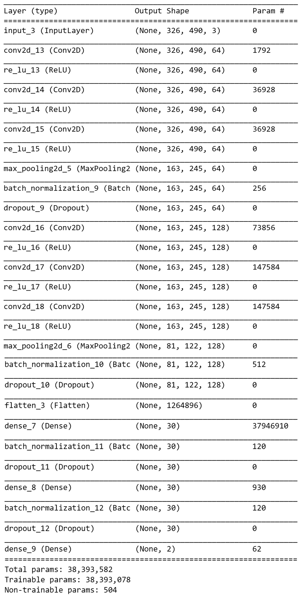
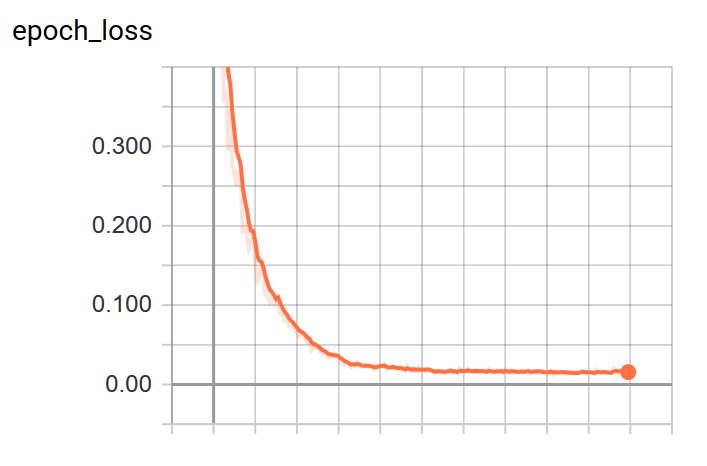
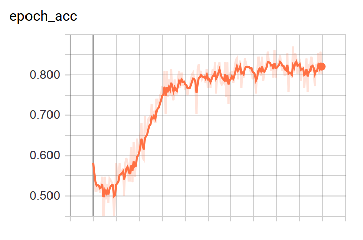

# Problem Description

This project goal is to find location of a phone dropped on the floor from a single RGB
camera image. This is a regression problem which can be solved using a simple convolution nural network. Example of the image is shown below:
   

   
Left-top corner of the image
is defined as (x, y) = (0, 0), left-bottom as (x, y) = (0, 1), right-top as (x, y) = (1, 0), and finally
right-bottom corner as (x, y) = (1, 1). Goal is to find normalized coordinates
of the center of the phone. In the example above, the coordinates of the phone are
approximately (x, y) = (0.83, 0.13).

# Dataset
Dataset contains 129 rgb images of size 490 x 326 x 3 and the labels are in the labels.txt file. Each line of the labels.txt is composed of img_path , x , y separated by spaces:  
img_path , x (coordinate of the phone), y (coordinate of the phone)

# Model Architecture
Below picture shows the architectural details of the CNN used to solve this problem. The architecture is quite big considering the simple problem. But smaller networks might also work fine when having a big dataset.
 

# Training

## Data Augmentation
Gaussian blur is applied on all 129 images using scipy python module. After data augmentation there are 258 images available for training. 10% of the images are used as validation set. 
To apply data augmentation run the below code. "./find_phone" is the directory where the images are stored. 
` $ python augment_data.py ./find_phone `  

## Train
To train the model on the dataset run the below code.  
` $ python train_phone_finder.py ./find_phone`  

I have trained the model for 200 epochs. Resulting accuracy is about ~81% . Training results are shown in the pictures below. model will be saved after training. 

## Inference
To test the model on your own image or test set run the below code. "./find_phone/12.jpg" is the path to the image whose phone co-ordinates are to be predicted. 
`$ python phone_finder.py ./find_phone/12.jpg`  
Output prints two values on the terminal. First value is the x co-ordinate value and second is y co-ordinate value.

## Future Work
Additional data augmentation such as horizontal and vertical flips can be implemented to produce more data for training.  Also, network can be made smaller by optimizing the convolution layers.
